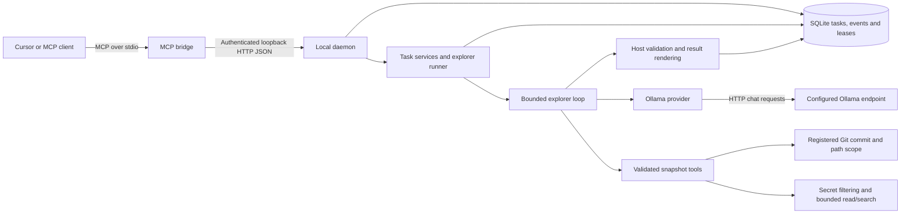

# Project architecture

Last reviewed: **20 September 2026**. This document describes the current source after the folder refactor. [Technical plan](technical-plan.md) describes the broader roadmap and includes features not yet implemented.

## Purpose and scope

`local-agent-host` lets an MCP client submit analysis tasks that survive a bridge disconnect. A separate local daemon owns durable task state and, in explorer mode, a bounded model loop that reads an immutable, filtered Git snapshot.

The implemented product is at **M2 read-only exploration**. It exposes analysis, status, cancellation and capability decisions. It does not expose repository editing, worktree mutation, arbitrary shell commands, production test execution, automatic model downloads, merge or push tools. M0's restricted coding fixtures are development diagnostics, not production repository-editing capability.

## Runtime topology

The bridge and daemon communicate locally. The intended Mac/Windows deployment can place the repository host and inference endpoint on different machines, but native Mac/Cursor and network qualification are separate gates. The current provider uses bounded non-streaming chat requests; roadmap streaming plans are not an implemented transport claim.

## Component ownership

| Component | Entry points and responsibility |
| --- | --- |
| MCP bridge | [`runtime/mcp-server.ts`](../src/runtime/mcp-server.ts) validates tool inputs, forwards requests and encodes MCP results; owns no task database |
| IPC client | [`runtime/ipc-client.ts`](../src/runtime/ipc-client.ts) handles authenticated loopback calls and response envelopes |
| Daemon | [`runtime/daemon.ts`](../src/runtime/daemon.ts) initializes storage/providers, serves routes, starts explorer scheduling and handles shutdown |
| Task contracts | [`domain/task-contracts.ts`](../src/domain/task-contracts.ts) defines strict input schemas and task/event types |
| Task store | [`store/task-store.ts`](../src/store/task-store.ts) owns admission transactions, idempotency, queue limits, events, deadlines and lease fencing |
| Snapshot admission | [`service/snapshot-task-service.ts`](../src/service/snapshot-task-service.ts) resolves the requested commit once and persists/restores snapshot identity |
| Runner | [`service/explorer-runner.ts`](../src/service/explorer-runner.ts) claims work, reserves durable budgets, observes cancellation/deadlines and publishes through the lease |
| Explorer loop | [`service/explorer-loop.ts`](../src/service/explorer-loop.ts) assembles context, validates model calls, dispatches read-only tools and manages bounded repair |
| Evidence and publication | `service/citation-validation.ts`, `exploration-coverage.ts`, `exploration-result-finalizer.ts` and `exploration-result-renderer.ts` validate observed evidence and render results |
| Repository tools | `exploration/` registers roots, enforces snapshots/scope, filters content and provides bounded read/list/search |
| Inference | `provider/` implements connectivity-only and explorer adapters; the model never receives direct process/filesystem authority |
| Common infrastructure | `shared/`, `utils/`, `constants/` and `prompts/` contain focused helpers and named values; they do not start runtime processes |
| Developer checks | `diagnostics/compatibility`, `diagnostics/task`, `diagnostics/exploration`, `evaluation/`, `scripts/` and `tests/` remain separate from production startup |

For the complete directory map, see [source structure](source-structure.md). Source directories are named by responsibility; milestone identifiers remain in documents and existing package command names.

## Provider modes

| Mode | Behavior |
| --- | --- |
| `fake` | Default deterministic task lifecycle; no repository analysis or model call |
| `ollama` | M1 connectivity worker sends the submitted objective/question and stores a bounded response and metrics; it does not inspect repository files |
| `explorer` | Opt-in M2 runner with registered repositories, snapshot-backed tools, filtered evidence and structured findings |

Model allowlists, limits and selected mode are host-owned. A model response cannot change provider, widen scope, install capabilities or increase budgets.

## Request and result flow

1. The client calls `analyze_repo` with a strict versioned request. The bridge forwards it to the authenticated daemon. `get_task` and `cancel_task` address the returned durable task id.
2. Admission validates input and idempotency. An identical canonical payload with the same repository/request key returns the existing task; a changed payload conflicts. Queue capacity applies after duplicate lookup.
3. In explorer mode, admission maps the registered repository id to a host-owned root, resolves the requested Git ref, and atomically stores the task, initial event and snapshot identity. Identity includes the base commit, snapshot id, root hash and optional scope hash.
4. The explorer runner selects queued work, claims a fenced lease and restores the admitted snapshot. It does not silently resolve a later HEAD on retry. Model turns and tool calls consume persisted budgets.
5. The loop offers `list_files`, `read_file`, `search_code` and `finish_analysis`. Calls are validated before dispatch. Reads/searches use eligible committed content with path scope, exclusions, secret filtering and output bounds; repository text remains untrusted data.
6. The host validates structured completion against evidence observed during the attempt, handles bounded repairs/coverage, derives excerpts/exact values and renders the public summary. Arbitrary assistant prose is not a successful completion path.
7. The store publishes the terminal result/events only for the active lease owner and generation. A new bridge can retrieve the task and bounded event pages; long polling does not transfer ownership to the bridge.

The completed explorer result is schema version 2 with findings, citations, limitations, snapshot identity and metrics. `verification` remains `not_run`; `semanticVerification` is `not_performed`. Grounded ranges and exact excerpts do not by themselves prove semantic correctness or runtime behavior. Prompt contract v32 additionally requires cited, verbatim conditional expressions for numeric status claims tied to supported single-line status ternaries. This narrow lexical guard uses the existing grounding repair and leaves semantic verification and live qualification open.

## Persistence, scheduling and recovery

SQLite WAL stores canonical task payloads, results, append-only events, schema metadata and snapshot identity. A separate capability service persists host capability decisions in the same configured database. Databases are ignored local state; configuration and raw machine reports must not be committed.

Task states include queued, running, blocked, cancelling, cancelled, completed, failed and budget_exceeded. Leases carry an owner, expiry and increasing generation. Deadline expiry and terminal publication release work according to guarded store transitions. Explorer cancellation aborts active inference; capability blocks preserve task/snapshot/budget state and can be resumed after a valid decision.

Startup recovery requeues interrupted running work and finishes interrupted cancellation. Explorer mode has a polling runner; fake/connectivity modes schedule admitted work through their existing submission path. Do not infer a universal exactly-once scheduler, complete crash supervision or automatic retry semantics from the recovery method alone. Durable state and reconnect behavior are implemented; operational supervision and further failure injection remain open work.

## Trust and process boundaries

- MCP input and model output cross validation boundaries. Strict contracts bound lengths, fields, paths and counts.
- The daemon binds loopback, checks Host/Origin, requires a bearer credential, compares it in constant time and caps JSON bodies at 65,536 bytes. Overflow returns 413 REQUEST_TOO_LARGE before closing the connection; within-cap JSON/schema errors remain 400 INVALID_INPUT. IPC is not an unauthenticated network service.
- Repository roots are registered by the host. Model-supplied paths cannot select arbitrary host roots, escape scope or replace the admitted commit.
- Read/list/search and completion paths apply filtering and bounds. Error publication uses bounded identifiers; raw provider bodies and credential-bearing configuration are not public diagnostics.
- Search uses available ripgrep or an explicitly recorded built-in fallback. Capability resolution records/rechecks choices; it does not automatically install software.
- Provider HTTP requests are bounded and cancellable. Only the host dispatches the supported tool calls. No model-generated shell strings are executed.
- MCP bridge stdout contains protocol only. Daemon readiness output belongs to its separate process; optional metrics/diagnostics use stderr.
- Git snapshots, process fixtures and worktrees are not security sandboxes. Future execution features require their own gates and design.

## Evidence and remaining gates

The current Windows refactor checks passed strict checking, 90 deterministic tests, M0 MCP/process probes and M1 fake-provider reconnect smoke. Those observations are recorded in [source validation](source-structure.md) and the [restructuring memory](memories/2026-09-20-source-organization.md), not newly measured by writing this document.

The historical frozen Windows M2 quality pair passed two reviewed 5/5 runs; see [the report](m2-quality-gate-v31-2026-09-19.md). It applies to the recorded source/model/settings, not automatic qualification of every later refactor. Native macOS/Cursor topology, operational supervision/token provisioning and additional failure injection remain open as described in milestone status documents. M3 editing/testing and later verification roles remain future work.

## Maintenance entry points

- Protocol or lifecycle change: M1 spec → runtime/domain/store → task tests and reconnect smoke.
- Scope/search change: explorer runbook → exploration/domain → scope/search/snapshot tests.
- Prompt/result change: M2 spec → prompts/service/provider → finding/citation/explorer regressions and quality-gate review.
- Layout/documentation change: source map → guidance spec → affected paths/links and memory index.

Follow [development workflow](development-workflow.md) and update this document when component ownership, data flow or boundaries change.
