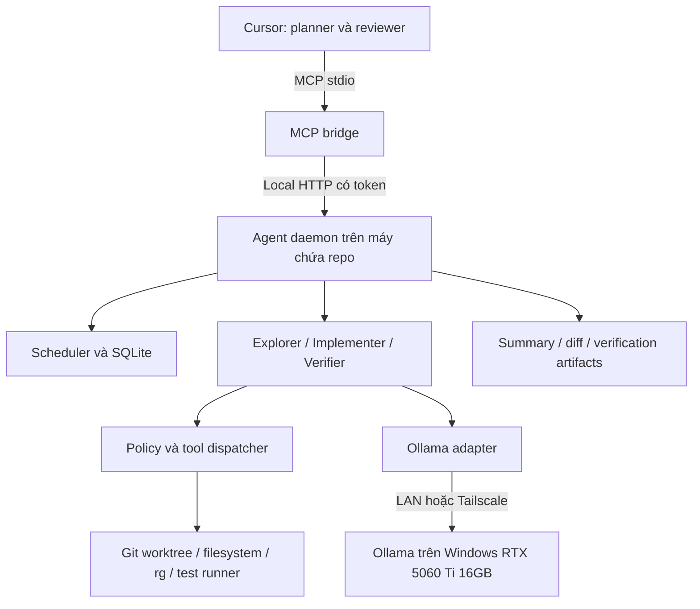

# Kế hoạch kỹ thuật: MCP + local agent trên macOS và Windows

Ngày thiết kế: 17/09/2026. Cập nhật: 18/09/2026. Kiến trúc mục tiêu bên dưới gồm cả phần chưa triển khai; trạng thái thực tế và bằng chứng Windows nằm trong `m0-status.md`, `m1-status.md`, `m2-status.md`. Hiện đang ở M2 read-only; chưa mở M3 edit/test tools.

## 1. Quyết định kiến trúc

Cursor giữ vai trò hiểu yêu cầu, chia task, quyết định kiến trúc và review. Local agent runtime nhận một task đủ rõ rồi tự lặp tìm kiếm → đọc → sửa → kiểm tra trong worktree. Ollama trên Windows chỉ thực hiện inference; mọi thao tác repo chạy trên máy chứa repo, ban đầu là Mac mini.

Chọn TypeScript strict + ESM, Node.js 22 ở patch được pin, pnpm được pin, MCP TypeScript SDK, Zod, git CLI, ripgrep và SQLite. MVP là một package với các module có ranh giới rõ; chưa cần monorepo hay framework agent nặng.

Tách hai entrypoint trong cùng package:

- **MCP bridge:** tiến trình nhỏ do Cursor khởi chạy qua stdio; kiểm tra schema, chuyển yêu cầu và trả kết quả ngắn.
- **Agent daemon:** tiến trình độc lập do người dùng/service manager chạy; sở hữu SQLite, queue, worktree, agent loop và child processes. Không sống nhờ vòng đời Cursor.

Lý do: một task có thể kéo dài nhiều phút. Trả task ID sớm và lấy trạng thái sau đáng tin cậy hơn việc giữ nguyên một MCP request xuyên suốt quá trình inference và chạy test.

## 2. Những gì đã kiểm tra và giới hạn hiện tại

- Đã đọc ngữ cảnh cuộc trao đổi trước và danh sách project khả dụng.
- Workspace cuộc trao đổi này chưa có mã nguồn phù hợp để mở rộng.
- Đã tìm manifest/package và tên file liên quan MCP/agent trong `D:\Repo`; chưa tìm thấy package phụ thuộc MCP SDK hoặc Ollama để reuse làm agent host. Đây là khảo sát có giới hạn, không chứng minh không có repo ở nơi khác.
- Có cấu hình hạ tầng `D:\Repo\ollama`: Docker Compose khai báo Ollama và Caddy, với image `ollama/ollama:latest` và `caddy:2-alpine`. Chưa xác minh dịch vụ đang chạy hoặc cấu hình proxy; không đọc nội dung `.env`.
- Chưa có đường dẫn hoặc quyền truy cập repo trên Mac mini trong phiên này. Vì vậy chưa xác nhận conventions, scripts, test runner hoặc network thực tế của repo chính.

Đề xuất tạo repo riêng tên `local-agent-host` khi chuyển sang implementation. Cấu hình Ollama hiện có là đầu vào để khảo sát/reuse lúc M0, không tự thay thế bằng một deployment mới. Khi truy cập repo đích: đọc `AGENTS.md`, manifest, lockfile, CI và hướng dẫn đóng góp; lấy các test commands hiện có để lập profile, không tự áp conventions của một repo Windows không liên quan.

## 3. Goals, non-goals và tiêu chí thành công

### Goals

1. Cursor giao task bằng `analyze_repo`, `implement_task`, `verify_task`; không cần điều khiển từng lần đọc file/sửa code/chạy test.
2. Runtime tự thực hiện task giới hạn rõ, có budget, cancellation, checkpoint và kết quả kiểm chứng được.
3. Mỗi task sửa code có branch/worktree riêng; checkout người dùng không bị thay đổi.
4. Chạy cùng codebase host trên macOS và Windows; inference endpoint cấu hình độc lập với vị trí repo.
5. Trả summary ngắn + change manifest + diff/commit + bằng chứng verification; chỉ tải chi tiết khi cần.
6. Tiết kiệm context/interaction của Cursor có đo lường. Không mặc định MCP tự giảm quota theo một tỷ lệ cố định.

### Non-goals MVP

- Không tự merge vào branch chính, push, tạo PR, deploy hoặc truy cập production.
- Không thay thế Cursor làm kiến trúc sư; không giả định model Ollama là native Cursor subagent.
- Không distributed scheduler, nhiều người dùng, multi-host task migration, swarm nhiều model đồng thời.
- Không embedding/vector DB/AST index toàn repo ngay từ đầu; dùng rg và cache theo hash.
- Không chạy code không đáng tin với cam kết sandbox mạnh trên host native.
- Không tự tải model, tự mở firewall, tự nâng dependencies hoặc sửa chính sách quyền để hoàn thành task.

### Acceptance mục tiêu cho MVP

- Một lệnh implement nhận task, runtime tự sửa và test fixture có lỗi đã biết, trả diff áp dụng được.
- Checkout chính giữ nguyên HEAD, index và trạng thái file trước/sau; các file người dùng đang sửa được bảo toàn.
- Đóng Cursor rồi mở lại vẫn tìm được task và kết quả; daemon restart không replay mù thao tác sửa/chạy lệnh.
- Một bộ fixture deterministic chạy trên macOS và Windows, bao gồm path có dấu/khoảng trắng, cancel và network failure.
- Secret canary không xuất hiện ở model request, log, MCP output hoặc artifact xuất cho Cursor.
- Bộ 10 task thử nghiệm thực tế báo cáo tỷ lệ hoàn thành, thời gian, số lần Cursor can thiệp và lượng nội dung trả về; ngưỡng đề xuất 8/10 task nhỏ hoàn thành trong budget. Đây là mục tiêu cần đo, chưa phải kết quả.

## 4. Topology và giao thức



MVP giả định MCP bridge được chạy trên Mac mini, cùng daemon. Nếu giao diện Cursor ở Windows, cần xác minh nơi Cursor thực sự spawn MCP: có thể chạy bridge qua SSH đến Mac bằng command cố định, host key đã kiểm tra. Không suy ra rằng mở remote folder đồng nghĩa MCP luôn chạy remote. Nếu cần native remote MCP, thêm Streamable HTTP sau M0, có TLS/auth và kiểm tra client compatibility.

| Liên kết | Quyết định |
|---|---|
| Cursor → bridge | MCP qua stdio. stdout chỉ chứa protocol; log sang stderr. |
| Bridge → daemon | HTTP JSON v1 trên loopback, bearer token ngẫu nhiên lưu ngoài repo, quyền file giới hạn; bind `127.0.0.1`, kiểm tra Host, từ chối Origin không hợp lệ. Không dùng CORS mở. |
| Daemon → Ollama | Native API `/api/chat`; NDJSON streaming, tools và kết quả tool được adapter chuẩn hóa. |
| Worker → repo tools | Lời gọi nội bộ typed; worker không truy cập filesystem/process trực tiếp. |
| Persistence | SQLite trên đĩa local của repo host; không đặt DB trên SMB/NFS hoặc sync giữa hai máy. |

Cursor có hỗ trợ cấu hình stdio và Streamable HTTP, nhưng phải smoke-test phiên bản đang cài, bao gồm tool discovery, output và timeout. [Cursor MCP](https://cursor.com/docs/mcp).

MCP SDK hiện công bố v2 stable với package tách `@modelcontextprotocol/server` và `@modelcontextprotocol/client`, Zod v4 qua Standard Schema. Chọn v2 làm ứng viên mặc định và pin exact version sau compatibility spike; không copy ví dụ v1 vào v2. Nếu client cần v1, adapter transport là nơi thay đổi, không đổi domain contracts. [MCP TypeScript SDK](https://github.com/modelcontextprotocol/typescript-sdk).

MCP sử dụng JSON-RPC; stdio không được ghi text thường ra stdout. Task queue dưới đây là giao thức ứng dụng của hệ thống này, không giả định client có hỗ trợ MCP Tasks extension. [MCP transports](https://modelcontextprotocol.io/specification/2025-11-25/basic/transports).

## 5. Component boundaries

| Component | Sở hữu | Không được tự quyết |
|---|---|---|
| MCP adapter | Input/output schema, request identity, artifact pagination | Workflow, command execution |
| Task service | Admission, idempotency, status transitions, result publication | Nội dung code |
| Scheduler | Queue, lease, deadline, concurrency, cancellation | Quyền filesystem |
| Agent runtime | Context assembly, model turns, role switching, stop conditions | Nới policy/budget |
| Explorer | Repo map, evidence, file candidates, conventions | Edit, test command tùy ý |
| Implementer | Patch trong phạm vi task, targeted verification, sửa lỗi có giới hạn | Merge/push, sửa policy |
| Verifier | Kiểm tra snapshot bất biến, test profile, đối chiếu acceptance | Sửa implementation để làm test pass |
| Repo adapter | Git, worktree, diff, status, hash, rg | Lựa chọn model |
| Tool dispatcher/policy | Kiểm tra quyền trước mọi side effect, input/output filtering | Tin lời tự nhận của model |
| Ollama adapter | HTTP, streaming, tool-call normalization, usage, cancellation | Tự thực thi tool_calls |
| Store/artifact service | Transactions, events, checkpoints, retention, access control | Lưu secret thô mặc định |

Explorer, implementer, verifier là role/profile của cùng runtime, chưa phải ba microservice hay ba model phải load đồng thời. Scheduler mặc định một inference request active cho PC; role verifier có context mới để giảm việc chỉ lặp lại kết luận implementer. Test runner và acceptance evidence mới là bằng chứng, không dùng sự đồng ý của hai lượt LLM như bảo đảm đúng.

## 6. MCP tool contracts

Schema JSON được sinh từ Zod, `schemaVersion: 1`, reject unknown fields, giới hạn độ dài chuỗi/mảng/output. Paths qua MCP là repo-relative; `repoId` ánh xạ server-side vào repo đã đăng ký. Model không được gửi đường dẫn root tùy ý.

### Submission chung

`repoId`, `requestKey`, `baseRef`, `objective`, `acceptanceCriteria[]`, `scope`, `budget`.

- `requestKey`: bắt buộc, unique theo client identity + repo. Cùng key và canonical payload trả cùng task; cùng key nhưng payload khác trả `IDEMPOTENCY_CONFLICT`.
- `baseRef`: tên ref hoặc commit ở thời điểm admission; server resolve một lần thành `baseCommit` đầy đủ. Không âm thầm đổi sang HEAD mới.
- `scope`: allow/deny path globs; chỉ được thu hẹp policy cấp repo.
- M2 đã triển khai tập con có kiểm soát: exact path, `directory/**`, hoặc `**`; deny ưu tiên, tối đa 32 patterns mỗi danh sách, case-sensitive theo Git. Scope được lưu cùng task và hash trong snapshot identity; focus paths vẫn chỉ là gợi ý. Chưa có arbitrary glob hay host repo-scope profile cấu hình được. Xem `explorer-runbook.md`.
- `budget`: thời gian, model turns, số tool calls, lượng output, số file/byte thay đổi và repair attempts; request không được vượt hard limits của host.

| Tool | Input riêng | Kết quả |
|---|---|---|
| `analyze_repo` | `question`, `depth: quick/standard`, optional focus paths | Task phân tích read-only, repo map/findings có file:line và snapshot hash. |
| `implement_task` | Acceptance criteria bắt buộc, verification profile IDs, `delivery: diff/commit` | Task sửa code, tự verify trước khi hoàn tất. |
| `verify_task` | `sourceTaskId` + `expectedChangeSetHash`, profile IDs; hoặc repo + exact commit | Task con read-only trên snapshot cố định. Không chạy trên worktree đang bị writer sửa. |
| `get_task` | `taskId`, optional `afterEventSeq`, `waitMs` tối đa 20 giây | Status, phase, progress, bounded events, terminal result khi có. |
| `cancel_task` | `taskId`, reason | Ghi cancel request idempotent; chỉ báo cancelled sau khi worker/children đã dừng. |
| `read_artifact` | `taskId`, `artifactId`, cursor, max bytes | Nội dung đã lọc theo trang, hash, next cursor. Không nhận đường dẫn local tùy ý. |

`get_task`, `cancel_task`, `read_artifact` phục vụ quản lý task; Cursor không cần tool read/edit/run-command ở mức file để hoàn thành nhiệm vụ được delegate.

Ví dụ payload hợp đồng, không phải code triển khai:

```json
{
  "schemaVersion": 1,
  "repoId": "main-app",
  "requestKey": "pagination-fix-001",
  "baseRef": "main",
  "objective": "Sửa lỗi trang cuối bị bỏ sót trong API phân trang",
  "acceptanceCriteria": [
    "Trả đủ phần tử ở trang cuối",
    "Có regression test cho tổng số phần tử không chia hết page size"
  ],
  "scope": {"allow": ["src/**", "tests/**"], "deny": ["**/.env*", ".github/**"]},
  "verificationProfiles": ["typecheck", "unit"],
  "delivery": "diff",
  "budget": {"maxWallSeconds": 1800, "maxModelTurns": 30, "maxRepairAttempts": 2}
}
```

Admission response: `taskId`, `status: queued`, `baseCommit`, `acceptedBudget`, `policyHash`, `pollAfterMs`. Chỉ trả accepted sau khi transaction lưu task + event đã commit.

Terminal result gồm:

- `outcome: completed | failed | cancelled | budget_exceeded`; `verification: passed | failed | inconclusive | not_run` tách riêng outcome.
- Summary, assumptions, unresolved items, acceptance matrix: mỗi criterion → bằng chứng hoặc chưa xác minh.
- `baseCommit`, `changeSetHash`, `worktreeId`, branch, optional `commitSha`.
- Changed files, additions/deletions, artifact IDs cho patch/manifest/report. Full diff không nhét vào MCP response mặc định.
- Checks: command profile, exit code, duration, tested snapshot, environment fingerprint, log artifact; baseline failure nếu đã có trước.
- Model tag/digest, context settings, attempts, usage và thời gian.

Summary mặc định giới hạn khoảng 6KB, events khoảng 8KB/lần, artifact khoảng 64KB/trang. Nếu overflow phải báo `truncated` và cursor; không cắt mất lỗi một cách im lặng. MCP trả structured output cùng text summary ngắn tương thích client.

Lỗi admission dùng mã có cấu trúc như `INVALID_INPUT`, `UNKNOWN_REPO`, `POLICY_DENIED`, `BASE_REF_NOT_FOUND`, `QUEUE_FULL`. Task đã accepted nhưng thất bại là trạng thái task, không giả làm lỗi giao thức MCP.

## 7. Internal tool contracts và context

| Tool nội bộ | Input/guard chính | Output |
|---|---|---|
| `list_files` | Prefix/glob trong worktree, limit | Paths và cursor |
| `search_code` | Pattern giới hạn, include globs, rg timeout | Matches có file/line, cap/truncation |
| `read_file` | Relative path, line range, expected hash tùy chọn | Text đã filter, line numbers, file hash |
| `apply_patch` | Patch, expected hashes, scope; deny symlink escapes | New hashes/change manifest; conflict không ghi dở |
| `git_diff` | Base commit do task giữ, bounded output | Diff summary/artifact |
| `run_check` | Profile ID và typed parameters được policy cho phép | Run ID, exit, output artifact, timeout status |
| `finish` | Summary + evidence refs | Runtime kiểm tra điều kiện hoàn tất trước khi chấp nhận |

### Capability preflight và fallback

Daemon kiểm tra capability trước lần dùng đầu tiên và cache kết quả theo executable path, version và thời điểm kiểm tra. `read_file` và `list_files` luôn dùng Node filesystem APIs. `search_code` ưu tiên ripgrep đã được resolve và kiểm tra version; nếu thiếu, task chuyển `blocked` với `reason: MISSING_CAPABILITY` và ba quyết định rõ ràng: `install`, `use_builtin_fallback`, hoặc `cancel`.

Quyết định cài đặt phải đến từ người dùng. Model không được tạo hay chạy command package-manager. Host chỉ đề xuất installer allowlisted phù hợp hệ điều hành, hiển thị package/source/command cụ thể, rồi verify executable/version/smoke sau khi người dùng đồng ý. Nếu client không hỗ trợ prompt/elicitation trực tiếp, MCP trả structured blocked response và Cursor gọi `resolve_capability` với quyết định của người dùng.

Nếu người dùng từ chối cài ripgrep, `search_code` dùng Node streaming scanner tích hợp: duyệt bằng `fs.opendir`, bỏ binary/file lớn/path deny, giới hạn regex, timeout, byte count và số match, rồi áp secret filtering như backend ripgrep. Không fallback sang raw PowerShell, `grep`, `find`, `findstr`, `cat` hay shell command. Git CLI và executable thuộc verification profile không có fallback tương đương; thiếu chúng thì task giữ trạng thái blocked hoặc bị hủy theo quyết định người dùng.

MVP không expose arbitrary shell cho model. Test commands nằm trong profile server-side đã review. Model có thể đề nghị thiếu profile; task chuyển blocked với lý do cụ thể thay vì tự nâng quyền.

Context pipeline: objective → acceptance → repo conventions → tìm kiếm có mục tiêu → chọn snippets → loop. Giới hạn byte mỗi file/tool, token budget và reserve output. Không dump toàn repo. Trước khi đầy context, compact findings có evidence refs; giữ nguyên objective, policy summary, pending tool state và test failures. Cache phải gắn commit/file hash và phiên bản filter; invalidate khi sửa file. Repo text, comments, README và model output đều là dữ liệu không đáng tin để cấp quyền.

Ollama tool calling chỉ trả yêu cầu gọi tool; runtime validate, execute và đưa kết quả về vòng chat. Native `/api/chat` hỗ trợ messages/tools và streaming; chọn native API để giữ metrics/options, OpenAI-compatible adapter để sau. [Tool calling](https://docs.ollama.com/capabilities/tool-calling), [Chat API](https://docs.ollama.com/api/chat).

## 8. Task lifecycle và scheduling

```text
queued → preparing → running → verifying → finalizing → completed
                    ↑             |
                    └── repairing ┘  (tối đa 2 vòng)

nonterminal → blocked → queued              (resume có kiểm tra)
nonterminal → recovering → queued/blocked   (sau crash)
nonterminal → cancelling → cancelled
nonterminal → failed / budget_exceeded
```

`blocked` chưa terminal, luôn có reason và required action. Terminal không bị chỉnh sửa; muốn thử lại task terminal tạo task mới liên kết task cũ. Resume blocked cần CLI quản trị hoặc contract bổ sung sau MVP; không tự mở rộng scope. Cancellation trước publication thắng; task đã commit kết quả terminal thì cancel trả trạng thái terminal hiện có.

1. Admission kiểm tra repo, quyền, schema, capacity, scope và resolve base.
2. Scheduler nhận lease bằng transaction; lưu owner, lease expiry và fencing generation để worker cũ không tiếp tục ghi sau takeover.
3. Preparing tạo worktree, ghi baseline, kiểm tra dependencies/profile và model availability.
4. Explorer lập findings; implementer đọc/sửa/check theo budget.
5. Freeze change set; verifier kiểm tra snapshot đó. Nếu fail do thay đổi mới, trả structured findings để repair trong budget rồi freeze/verify lại.
6. Finalizing quét secret, kiểm tra scope, xuất artifacts atomic, optional commit và publish terminal result.
7. Giữ worktree/artifacts để review; cleanup riêng sau retention.

MVP: tối đa 1 active task tổng thể và 1 inference request tới GPU; queue cap 20 là default đề xuất. Thiết kế khóa theo repo/worktree và inference endpoint để sau này tăng concurrency nhưng chưa bật.

Default budget đề xuất: analysis 10 phút/12 model turns; implement 30 phút/30 turns/2 repairs; verify 15 phút. Tổng deadline bao gồm network retry và test execution. Queue có expiry riêng để task không nằm vô hạn khi PC tắt. Các giá trị sẽ hiệu chỉnh qua M0.

## 9. Worktree isolation và xuất kết quả

- Đăng ký repo bằng canonical path và git common directory; không cho hai repo IDs trỏ cùng repo để lách lock.
- Mỗi implementation tạo branch `agent/<task-id>` từ exact base SHA và worktree dưới thư mục quản lý nằm ngoài checkout chính.
- Snapshot mặc định là committed tree. Nếu checkout người dùng dirty, báo rõ thay đổi chưa commit không được đưa vào task; không stash/reset/clean checkout người dùng. Import dirty snapshot là tính năng sau, có contract riêng cho tracked/untracked/ignored files.
- Analysis cũng đọc từ snapshot/worktree riêng, tránh câu trả lời trộn hai thời điểm khi người dùng đang sửa repo.
- Không tái dùng `node_modules` bằng symlink giữa worktrees; mỗi worktree có install riêng, có thể tận dụng pnpm store. Install dùng lockfile frozen và policy bootstrap; không mặc định cho package lifecycle scripts chạy.
- Git worktrees chia sẻ object database và một phần metadata repo. Runtime bảo vệ `.git`, refs/config/hooks và serialize thao tác metadata. Worktree không tạo ranh giới bảo mật OS. [Git worktree](https://git-scm.com/docs/git-worktree).
- Chạy Git noninteractive với executable đã resolve, argument arrays, separator và ref đã validate; không dùng raw model strings làm options. Vô hiệu external diff/textconv và hooks không được duyệt. Git filters, submodules, LFS và bootstrap scripts cần preflight; MVP có thể block repo cần extension chưa hỗ trợ.
- Freeze writer khi verify. Verification chạy từ immutable candidate snapshot ở worktree riêng; fingerprint source trước/sau. Nếu test thay tracked files, kết quả không còn chứng thực snapshot ban đầu và phải xử lý rõ.
- Change-set hash tính trên base + manifest path/mode/content hash, gồm cả file mới, delete/rename và binary. Không chỉ dựa vào `git diff` vốn có thể bỏ sót untracked files.
- Xuất patch đầy đủ từ tập thay đổi được duyệt, bao gồm binary khi policy cho phép; kiểm tra áp dụng vào clean worktree từ base trước publication. Binary/large files bị giới hạn ở MVP, không âm thầm bỏ qua.
- `delivery=commit` tạo local commit trên branch task sau secret scan và verification. Không push/merge. Nếu thay đổi sau verify, invalidates verification và phải chạy lại.
- Khi branch chính đã tiến lên, trả base SHA cũ để Cursor thấy rõ; không tự rebase. Apply/merge thuộc bước review tích hợp riêng.
- Cleanup mặc định worktree terminal sau 7 ngày, artifacts/events 30 ngày; task failed/blocked không tự xóa khi còn nội dung cần cứu. Chỉ xóa path có ownership marker đúng và canonical path nằm trong root quản lý; cleanup retry không được ảnh hưởng checkout khác.

## 10. Security, secrets và trust model

**MVP native phù hợp repo do người dùng tin cậy.** Path allowlist và secret filter bảo vệ tool API, nhưng `pnpm test` thực thi code của repo, có thể đọc file hoặc gọi mạng ngoài worktree. Không tuyên bố worktree hay command allowlist là sandbox. Repo không tin cậy cần container/VM hoặc dedicated OS account có quyền và network bị hạn chế; việc chọn isolation mạnh là gate trước khi hỗ trợ loại repo đó.

### Policy hierarchy

Host policy ngoài repo → repo profile đã đăng ký → scope của task. Mỗi tầng chỉ thu hẹp quyền. Chụp policy hash vào task. File conventions/AGENTS.md có thể hướng dẫn style/test nhưng không được mở filesystem/network permissions. Model không được sửa registry, profiles, model endpoint hay secret filters.

### Path/process controls

- Canonicalize root và parent tồn tại; dùng containment theo path semantics, không dùng string prefix.
- Chặn `..`, absolute path, drive-relative/UNC/device paths và Windows alternate data streams trong model tool inputs.
- Validate symlink/junction/reparse targets; MVP từ chối mutation qua symlink và file hardlink nhạy cảm. Kiểm tra lại trước thao tác; nhận diện TOCTOU vẫn là giới hạn native, không thay cho OS isolation.
- Deny `.git`, credential files, private keys, `.env*`, registry/policy và paths ngoài scope; template không có secrets như `.env.example` chỉ được allow theo profile cụ thể.
- Không kế thừa toàn bộ environment vào subprocess: allowlist PATH/runtime/temp và biến test cần thiết; bỏ tokens, SSH agent, cloud credentials, Git credential helpers và interactive prompts.
- Process runner chỉ nhận profile IDs; profile pin executable/argv/cwd/env/timeout. Package scripts vẫn cần trust review vì bản thân chúng chạy code tùy ý.

### Secret pipeline

1. Bỏ qua sensitive paths trước khi đọc/index.
2. Scan nội dung được chọn trước khi gửi Ollama, gồm prompt, snippets và tool output.
3. Redact trước khi ghi log/event/model transcript hoặc trả Cursor.
4. Quét diff/summary/artifacts trước publication; nếu phát hiện secret trong patch thì block artifact/commit thay vì thay secret bằng placeholder khiến patch sai.
5. Artifact chứa secret bị quarantine, không mở qua MCP; không lưu raw prompt/transcript mặc định. Chỉ lưu transcript đã lọc khi cần recovery/debug, cùng TTL và quyền file giới hạn.

Filter kết hợp filename rules, credential patterns, known secret values khi đã được provision và entropy heuristic. Dùng streaming buffer để secret bị chia giữa chunks vẫn được lọc. Filter là defense-in-depth, có false positives/negatives; không coi là chứng minh không rò rỉ.

Cursor có thể nhận summary/diff và đưa vào model cloud theo cấu hình của Cursor. Local inference không đồng nghĩa toàn bộ workflow giữ code local; vì vậy áp dụng filtering cả trên output về Cursor.

## 11. Ollama connectivity và chọn model

Registry ngoài repo chứa endpoint alias, base URL, model profile và secret reference. Request của model không được đổi URL, redirect không được theo tùy ý; chỉ cho endpoint được đăng ký để tránh SSRF.

Ưu tiên Tailscale giữa Mac mini và PC, với ACL chỉ Mac gọi endpoint inference; không mở ra Internet. LAN thuần chỉ dùng trong mạng tin cậy với firewall giới hạn nguồn; nếu cần bảo mật đường truyền trên LAN, dùng TLS proxy. Caddy hiện có có thể reuse sau khi inspect. Không coi raw Ollama endpoint là dịch vụ đã có authentication thích hợp.

Ollama mặc định bind loopback, `OLLAMA_HOST` điều khiển bind address. Nếu Ollama trong Docker phải kiểm tra cả host port mapping, container bind, GPU passthrough và firewall; chỉ đổi biến môi trường Windows chưa chắc tác động container. `OLLAMA_NO_CLOUD=1` là lựa chọn local-only trong tài liệu. Các thay đổi cấu hình này là công việc M0, chưa thực hiện. [Ollama FAQ](https://docs.ollama.com/faq).

Preflight từ **Mac mini**:

- Probe phiên bản, danh sách model (`/api/version`, `/api/tags`), model metadata/capabilities và model đang load.
- Tiny chat + một tool call schema thực tế, xác nhận round trip tool result.
- Đo cold load, time-to-first-token, tốc độ sinh, context usage và CPU/GPU split.
- Thử network disconnect, PC sleep, GPU OOM, cancel và endpoint sai.

Không tự pull model nếu thiếu; chuyển blocked với model cần cài. Chỉ dùng tags đã allowlist, ghi digest để biết model có thay đổi.

`qwen3-coder:30b` Q4_K_M hiện được liệt kê khoảng 19GB. Với VRAM 16GB, không chọn nó trên giả định full-GPU; còn cần memory cho KV cache/runtime. MoE có ít tham số active không có nghĩa chỉ cần chứa phần active. Đây là ứng viên benchmark CPU/GPU offload, phụ thuộc RAM hệ thống chưa biết. [Ollama model card](https://ollama.com/library/qwen3-coder:30b).

M0 so sánh một model tool-capable nhỏ hơn đã có trên máy với ứng viên 30B, dùng cùng bộ task. Chưa chốt tên model nhỏ hơn khi chưa inventory/benchmark. Khởi đầu context 8K, thử 16K nếu bộ nhớ/latency cho phép; không bật native max context mặc định. Một model có thể đảm nhiệm cả ba role để giảm model swapping.

Adapter có connect timeout 5 giây, first-token timeout cold-load khoảng 180 giây, stream-idle 60 giây và request deadline tối đa 10 phút, đều nằm trong task deadline. Các mức này là cấu hình thử nghiệm. Abort HTTP không chứng minh GPU đã lập tức dừng; endpoint semaphore và cooldown ngăn retry storm.

## 12. Cross-platform

| Vấn đề | Quyết định |
|---|---|
| Paths | `node:path`/`fs`, canonical containment; Git paths trong manifest dùng `/`, native paths chỉ trong adapter. Test Unicode, case folding, drive letters và path dài. |
| Process launch | `spawn(executable, argv)` hoặc adapter tương đương, tránh shell interpolation. Git/rg là executable đã resolve. |
| pnpm trên Windows | Không giả định `spawn('pnpm', args, shell:false)` chạy được `.cmd`. Resolve entrypoint JS tin cậy chạy qua Node hoặc adapter launcher riêng đã test; không bật `shell:true` cho input của model. |
| Cancellation | POSIX process group và signal/grace/kill; Windows process-tree adapter. M0 chọn Job Object/helper hoặc giải pháp đã kiểm thử, gồm orphan cleanup sau host crash. |
| Encoding | UTF-8 cho JSON/log, decoder xử lý multibyte chunks; đọc Git status dạng `-z` để không parse sai filename. |
| Line endings | Tôn trọng `.gitattributes`; giữ EOL hiện có, không rewrite toàn file chỉ để đổi LF/CRLF. |
| Permissions | Không dựa chỉ vào chmod cho Windows; ACL phù hợp với daemon token/artifacts. |
| Runtime | Pin Node 22 patch và pnpm; check prerequisites trong doctor. SQLite native dependency phải có prebuild hoặc quy trình build được test trên macOS arm64 và Windows x64. |
| State dirs | OS app-data directory; worktrees ở managed root ngắn, cấu hình được; tránh OneDrive/network share cho SQLite. |
| Services | Cùng CLI `host start/stop/status/doctor`; service wrappers launchd/Windows bổ sung sau functional MVP. |

Node ghi rõ `.bat`/`.cmd` trên Windows cần xử lý khác Unix; vì vậy package-manager launcher phải là abstraction được test, không chỉ thay slash trong path. [Node child processes](https://nodejs.org/api/child_process.html).

## 13. Persistence schema

SQLite dùng migrations, foreign keys, WAL và busy timeout; transaction ngắn, không giữ transaction trong lúc gọi model/chạy test. Chọn driver qua M0; ứng viên `better-sqlite3` sau kiểm tra prebuild trên Node 22/macOS arm64/Windows x64. Không phụ thuộc API experimental của runtime để đạt MVP.

| Table | Cột chính / constraint |
|---|---|
| `schema_migrations` | version PK, applied_at, checksum |
| `repos` | id PK, canonical_root UNIQUE, git_common_dir UNIQUE, profile_id, config_hash |
| `tasks` | id PK, repo_id FK, parent_task_id FK nullable, kind, status, phase, objective_redacted, input_json_redacted, request_hash, client_id, request_key, base_sha, policy_hash, budget_json, deadline, cancel_at, lease_owner, lease_until, generation, timestamps; UNIQUE(client_id, repo_id, request_key) |
| `attempts` | id PK, task_id FK, ordinal, model_profile, model_digest, config_json, checkpoint_id, status, usage_json, error_code; UNIQUE(task_id, ordinal) |
| `worktrees` | id PK, task_id FK, canonical_path UNIQUE, branch, base_sha, snapshot_hash, ownership_marker, state, cleanup_after |
| `steps` | id PK, task_id FK, attempt_id FK, sequence, kind, tool_name, args_hash, status, precondition_hash, result_ref, started_at, ended_at; UNIQUE(task_id, sequence) |
| `checkpoints` | id PK, task_id FK, sequence, phase, snapshot_hash, context_ref, pending_step_id, created_at |
| `checks` | id PK, task_id FK, profile_id, snapshot_hash, env_fingerprint, exit_code, status, duration_ms, output_artifact_id |
| `artifacts` | id PK, task_id FK, kind, managed_relative_path, sha256, byte_size, sensitivity, created_at, expires_at |
| `events` | task_id FK, seq, timestamp, event_type, payload_redacted; PRIMARY KEY(task_id, seq) |

Indexes cho `(status, deadline)`, `(repo_id, created_at)`, lease expiry và artifact expiry. Status update + event insert cùng transaction. Artifacts ghi temp → rename atomic → transaction đăng ký; startup dọn temp/orphan an toàn. Không lưu secrets vào input JSON, kể cả khi cần replay; secret refs tách riêng.

DB chỉ là source of truth về orchestration; Git/filesystem là source of truth về file effects. Vì không thể transaction chung SQLite và Git, mọi mutation có intent trước và receipt/hash sau. Recovery reconcile thực tế thay vì tin rằng row `started` nghĩa là chưa thực hiện.

## 14. Failure, retry và recovery

| Failure | Xử lý |
|---|---|
| Ollama unreachable/timeout/5xx/429 | Retry inference read-only tối đa 2 lần, exponential backoff + jitter, tôn trọng Retry-After trong deadline. Circuit breaker sau nhiều lỗi; blocked khi endpoint chưa phục hồi. |
| Response stream đứt | Bỏ assistant turn chưa hoàn chỉnh, không execute partial tool call; retry từ checkpoint đã xác nhận. |
| Tool JSON sai schema | Trả lỗi validation cho model để sửa tối đa 2 lần; không parse/execute gần đúng tùy tiện. |
| Patch stale/conflict | Không ghi partial; đọc lại hash/context, re-plan trong repair budget. |
| Test fail | Phân biệt baseline failure, regression và hạ tầng; repair giới hạn. Không đổi expected test để che lỗi. |
| Test timeout | Dừng process tree, lưu evidence; inconclusive, không coi pass. |
| GPU OOM | Không retry cùng cấu hình vô hạn; blocked hoặc chọn profile fallback đã đăng ký rồi ghi rõ model/context mới. |
| Disk full/artifact write fail | Dừng mutations, giữ worktree và trạng thái có thể cứu; không publish completed thiếu artifact. |
| Daemon crash | Startup lấy lease hết hạn vào recovering, kiểm tra process/worktree/step journal; chỉ resume ở checkpoint an toàn. |
| Side effect không rõ đã chạy chưa | Reconcile hashes/commit/tree; command không chứng minh idempotent thì blocked, không replay tự động. |
| Cancellation | Ghi intent, abort network, chặn tool mới, dừng child tree, checkpoint, rồi cancelled. |

Không hứa exactly-once execution toàn hệ thống. Bảo đảm logical submission idempotent, một writer hợp lệ tại một thời điểm, và mutation recovery dựa pre/postconditions. `run_check` chỉ tự retry nếu profile được xác định retry-safe; command bootstrap/install không mặc định như vậy.

Commit recovery: lưu candidate tree hash/parent/message intent; nếu crash sau commit trước DB update, tìm branch tip phù hợp và gắn lại receipt thay vì tạo commit mới. Task ID trong metadata/message hỗ trợ đối chiếu.

## 15. Observability và trải nghiệm Cursor

- Structured JSON logs có task/attempt/step IDs, phase, duration và error code. Redact trước serializer/sink; không dump environment/request body.
- Events ngắn: queued, started, phase_changed, check_failed, retry_scheduled, blocked, completed. Không gửi token-by-token vào Cursor.
- Metrics: queue wait, cold load/TTFT, prompt/eval tokens nếu Ollama cung cấp, tool duration, check pass rate, repairs, cancellation latency, artifact bytes và payload trả Cursor. Token counts thiếu thì để unavailable, không giả số 0.
- CLI doctor: Node/pnpm/git/rg, writable state/worktree paths, SQLite mở được, Ollama reachable/model tools-capable. Health của daemon tách readiness của inference.
- Summary chỉ nhắc quyết định và evidence; log/patch đọc theo yêu cầu. `get_task` hỗ trợ long-poll ngắn và `pollAfterMs` để tránh tight polling. Không giả định notification tự đánh thức Cursor agent.
- Quy tắc Cursor dự kiến: gửi objective/scope/acceptance; lấy task handle; chờ theo poll hint; đọc kết quả; review diff; chỉ can thiệp khi blocked hoặc cần quyết định kiến trúc. Không tự viết lại thay đổi trong worktree đang thuộc task.
- Đo tiết kiệm bằng số lượt orchestrator, byte/context trả Cursor và usage UI nếu có. Local token usage không đủ để suy ra quota Cursor đã giảm bao nhiêu.

## 16. Scaffold tối thiểu đề xuất

Đây là cấu trúc dự kiến, chưa tạo project/source files:

```text
local-agent-host/
  package.json
  pnpm-lock.yaml
  tsconfig.json
  README.md
  AGENTS.md
  .gitignore
  src/
    cli.ts
    mcp/              # stdio adapter, registration, output mapping
    contracts/        # Zod schemas, task/result/error types
    host/             # local HTTP API, auth, lifecycle
    tasks/            # service, scheduler, state machine, recovery
    agent/            # loop, roles, prompts, context budget
    models/           # provider interface, Ollama adapter
    tools/            # dispatcher, file/search/patch/check tools
    repo/             # git, worktrees, snapshot, change manifest
    execution/        # process launcher, OS process tree adapters
    policy/           # paths, scopes, secrets, environment
    storage/          # SQLite repositories, migrations
    artifacts/        # publish, pagination, retention
    observability/    # logs, metrics, events
  config/
    host.example.json
    repo-profile.example.json
  tests/
    unit/
    integration/
    contracts/
    recovery/
    fixtures/
    e2e/
  docs/
    architecture.md
    protocols.md
    security-model.md
    operations.md
    adr/
```

Một package đủ cho hai executables `local-agent-mcp` và `local-agent-host`. Vitest là ứng viên test runner; tsc để build, scripts check/lint/test/build, formatter theo convention thống nhất. Pin versions khi scaffold và kiểm tra runtime support; chưa chọn dependency versions từ trí nhớ.

## 17. MVP milestones và definition of done

| Mốc | Deliverables | Gate hoàn tất |
|---|---|---|
| M0 — Discovery & spikes | Inspect repo Mac, Cursor spawn location, Node/pnpm/Git/rg; inspect Ollama deployment; benchmark 2 model profiles; chọn SDK/SQLite/Windows process adapter | Mac gọi Ollama thành công với tools; MCP smoke test; một process tree có child/grandchild hủy được trên hai OS; ghi ADR model/context và dependency versions. |
| M1 — Task backbone | Scaffold, schemas, bridge/daemon, auth, SQLite, queue/idempotency/cancel/status với fake provider | Task sống qua Cursor disconnect; duplicate requests không tạo task đôi; daemon restart vào trạng thái đúng; OS CI xanh. |
| M2 — Exploration | Repo registration, snapshot/worktree, path/secret filtering, rg/read tools, bounded context | Analyze fixture và repo thật trả findings có evidence, không sửa source; canary filtering qua request/log/output pass. |
| M3 — Implementation | Patch preconditions, process profiles, read/edit/check loop, budgets, journal, diff/commit | Tự sửa fixture regression trong worktree, trả patch áp dụng được; checkout chính nguyên vẹn; crash/cancel không replay mutation mù. |
| M4 — Verification & acceptance | Snapshot verifier, baseline comparison, acceptance matrix, repair cap, artifact integrity, Cursor workflow | End-to-end từ Cursor; failure injection đạt yêu cầu; đánh giá 10 task thực tế và ghi giới hạn. Đây là MVP hoàn chỉnh. |
| M5 — Sau MVP | Remote Streamable HTTP nếu cần, service installers, mạnh hóa sandbox, tăng concurrency, retrieval nâng cao | Chỉ ưu tiên theo bottleneck đã đo, không thêm vì có thể. |

Thứ tự phụ thuộc M0 → M1 → M2 → M3 → M4. Nếu process isolation/launcher hoặc model tool calling chưa đạt M0 thì không đẩy rủi ro sang cuối dự án. Không ước lượng lịch chắc chắn trước khi biết repo Mac, RAM PC và kết quả inference.

## 18. Test strategy

### Deterministic CI, không cần GPU

- Unit/property tests cho path traversal, symlink/junction, prefix collision, Unicode/case, Zod contracts, budget/state machine và secret split-chunk filtering.
- Contract tests bridge ↔ daemon ↔ store; MCP initialize/list/call, structured response, invalid schema, pagination, cùng requestKey khác payload.
- Git fixture tests cho dirty primary checkout, untracked/new/deleted/binary files, CRLF, stale base, worktree failure, complete patch apply, commit recovery, cleanup ownership.
- Fake Ollama server cho streaming chunks, multiple tool calls, malformed JSON, tool response ordering, timeouts, midstream disconnect và cancellation. Chỉ execute khi turn/tool arguments đã hoàn chỉnh.
- Failure injection tại ranh giới intent/write/receipt, SQLite lock/full disk, lease expiration, duplicate workers và artifact rename/DB registration.
- Process tree tests gồm child/grandchild, timeout và host crash trên Windows/macOS. Test network side effects dùng fixtures cô lập.
- Secret canary test xuyên suốt: file → model payload → tool output → DB/log/artifact/MCP; kiểm tra không lọt dữ liệu thô.

### Real-model evaluation

- Bộ task cố định gồm exploration, bug fix nhỏ, test bổ sung và verification có failure cài sẵn; chấm theo tests/evidence, không chỉ model tự báo thành công.
- Ghi model digest, quantization, context, CPU/GPU split, hardware/RAM, cold/warm timings và prompts version để so sánh.
- Không assert text output giống tuyệt đối; đo success rate và tool validity qua nhiều lượt khi cần. Tách hardware eval khỏi CI để không làm CI flaky.
- Manual acceptance trên topology thật: Cursor → bridge trên Mac → daemon/worktree → Ollama Windows; thêm PC sleep/reconnect và Cursor restart.

CI tối thiểu macOS và Windows với Node 22 pin. Nếu hosted macOS không đúng kiến trúc Mac mini, bổ sung smoke test trên Mac thật. Kiểm tra thêm phiên bản Node mới hơn chỉ là forward compatibility, không thay yêu cầu Node 22.

## 19. Future enhancement — scale test và xử lý khi chạm giới hạn

Trạng thái: backlog, chưa triển khai/chưa đo năng lực tối đa. Không coi số tests pass hay hard limits cấu hình là bằng chứng tải vận hành. Hoàn thiện các gate M2 trước; chỉ nâng concurrency hoặc budget dựa trên số liệu.

- Benchmark kích thước: tăng số file/tree entries, byte/file, lượng search matches và context; đo ngay dưới, đúng và trên từng ngưỡng. Tách giới hạn snapshot khỏi giới hạn inference.
- Benchmark độ khó: task cần đọc 1/5/10/20 file, chấm độ đúng, evidence/citation coverage và tỷ lệ hoàn tất thay vì chỉ trạng thái completed.
- Benchmark tải: 1/5/10/20/21 submission, queue wait, p50/p95 latency, throughput, RSS/RAM/VRAM, cancellation/recovery. Chạy cold/warm nhiều lượt; ghi hardware, model digest, context, runtime và cấu hình. Thiếu metric thì ghi unavailable.
- Đầu ra: báo cáo tái lập được, ngưỡng lỗi và mức tải ổn định có headroom. Không tự tải model, tăng quyền hay sửa cấu hình GPU để chạy benchmark.
- Khi hết context/turn/tool/deadline: lưu partial findings, evidence refs và pending work đã lọc; kết thúc trung thực, cho phép task tiếp nối có parent ID trên cùng commit. Terminal cũ không bị sửa, budget không tự reset hoặc tăng; continuation có budget được host chấp nhận.
- Khi output/search bị cắt: trả lý do, cursor và scope để đọc tiếp; scope theo module/thư mục phải được enforce, không chỉ là focus hint. Snapshot quá lớn cần scoped admission, không âm thầm bỏ file rồi tuyên bố đã phân tích toàn repo.
- Khi queue đầy: backpressure và retry hint; client retry có backoff/jitter bằng cùng request key cho cùng payload. Khi inference/OOM: không lặp vô hạn; báo lỗi hoặc dùng fallback profile đã được cho phép, ghi rõ cấu hình thay đổi.
- Gate: không mất/nhân đôi task, không nới policy, không mất provenance khi resume, partial result không giả completed, cancellation vẫn hoạt động lúc quá tải và canary không lọt qua checkpoint/report.

Mốc tham chiếu hiện tại (cần đọc lại code khi benchmark): một explorer active; capacity mặc định 20 task chưa kết thúc; tối đa 600 giây gồm queue wait, 12 model turns/60 tool calls, transcript 24.000 byte và tool result 12.000 byte. Đây là giới hạn cấu hình, không phải năng lực máy đã đo. Checkpoint/compaction, search continuation và tự chia task chưa được triển khai.

## 20. Thông tin cần xác minh khi bắt đầu implementation

1. Đường dẫn repo chính trên Mac mini và cách truy cập; conventions/test profiles thực tế.
2. Cursor chạy ở máy nào và MCP process được spawn ở đâu.
3. Ollama đang chạy native hay Docker/Caddy đã tìm thấy; endpoint từ Mac, Tailscale/LAN và authentication hiện có.
4. RAM hệ thống PC, model đã cài, context đang cấu hình và tốc độ thực đo.
5. Repo/task chỉ thuộc trust tier nội bộ hay cần chạy code không tin cậy trong VM/container.

Các điểm này không chặn bản planning. Chúng là đầu vào cụ thể của M0 trước khi chốt scaffold và cấu hình kết nối. Bước implementation đầu tiên nên là vertical slice rất nhỏ: `analyze_repo` qua Cursor, queue SQLite, một fake provider rồi Ollama thật, chỉ read/search trên snapshot. Sau khi đường đi đó ổn mới mở quyền edit/test.
